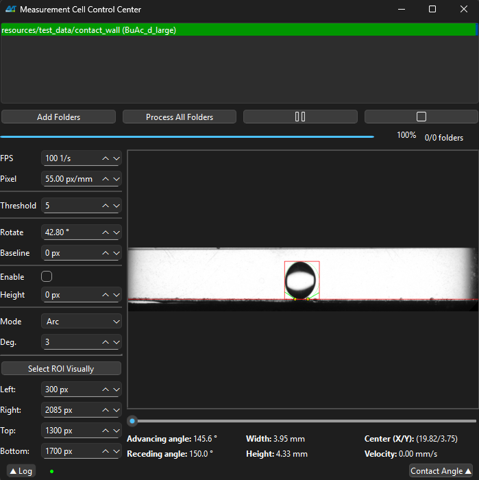

# Droplet Wall Interaction Tool

<!-- Badges: Replace URLs with actual badge links as appropriate -->
[](https://doi.org/XX.XXXXX/joss.XXXXXXX)


> Droplet Wall Interaction Tool (DWIT) is a research-oriented platform for qualitative image analysis of droplet experiments. Designed for academic and scientific workflows, it provides a reproducible, extensible, and user-friendly environment for analysis workflow automation and data analysis.

---


## Table of Contents
- [Features](#features)
- [Project Structure](#project-structure)
- [Screenshots](#screenshots)
- [Quick Start](#quick-start)
- [Usage Examples](#usage-examples)
- [Configuration](#configuration)
- [Troubleshooting](#troubleshooting)
- [Detailed Image Analysis Pipeline](#detailed-image-analysis-pipeline)
- [Contributing](#contributing)
- [Test Data and Usage](#test-data-and-usage)
- [License](#license)
- [Citation](#citation)
- [Contact](#contact)
- [Credits / Acknowledgments](#credits--acknowledgments)
---


<a name="features"></a>
## Features

- 📊 **Analysis Tab:** Enables batch image processing, contact angle measurement and diameter calculation.
- 🔵 **Droplet Measurements:** Automatically calculates droplet area and equivalent diameter using D=√(4A/π) formula.
- 🖼️ **Visual ROI & Baseline:** Provides both graphical and numeric interfaces for region selection and baseline adjustment.
- 🗂️ **Batch Processing:** Supports analysis of multiple datasets with progress visualization.
- 📈 **Velocity Analysis:** Tools for droplet dynamics and time-series analysis.
- 📝 **Log Overlay:** Real-time logging of errors, warnings, and informational messages with status indicators.
- 🧪 **Manual Testing:** Includes curated test images for rapid validation and reproducibility.
- ⚡ **Modern UI:** Built with PySide6 (Qt for Python) for cross-platform compatibility and performance.
 - 🔀 **Modes:** free_sedimentation, contact_angle, channel, structured_packing.
 - ⚠️ **Channel mode note:** Automatic baseline detection is currently disabled; channel overlays/metrics require externally provided baselines.

---


<a name="project-structure"></a>
## Project Structure

This project follows modern Python best practices with a `src` layout:

| Directory            | Purpose                                              |
|----------------------|------------------------------------------------------|
| `src/`               | Source code package (importable as `src`)            |
| `src/analysis/`      | Core analysis pipeline, processors, and contact angle methods |
| `src/helpers/`       | Image processing, geometry, initialization, and visualization helpers |
| `src/utilities/`     | Cross-cutting utilities: image, logging, overlays, threading, measurements |
| `src/widgets/`       | Reusable Qt widgets for UI components                |
| `tests/`             | Test images organized by experiment type             |
| `pyproject.toml`     | Package metadata and tool configuration              |

The `src` layout ensures clean separation between source code and other project files, following [PEP 517](https://peps.python.org/pep-0517/) and [PEP 518](https://peps.python.org/pep-0518/) standards.

---


<a name="screenshots"></a>
## Screenshots

<p align="center">
  
  <br><em>DWIT: Batch image analysis and visualization.</em>
</p>

---


<a name="quick-start"></a>
## Quick Start

To install and launch Droplet Wall Interaction Tool (DWIT):

```sh
python -m venv venv
venv\Scripts\activate  # On Windows
# or
source venv/bin/activate  # On macOS/Linux
pip install -r requirements.txt
python dwit.py
```

Alternatively run `dwit.py` from your IDE with the correct Python environment.

---


<a name="usage-examples"></a>
## Usage Examples

### Batch Analysis (UI-driven)

1. Organize experiment images in a folder (see `tests/` for examples).
2. Launch DWIT and navigate to the **Analysis** tab.
3. Add or remove folders for batch processing as needed.
4. Adjust ROI, threshold, and baseline parameters.
5. Use **Preview** for a preliminary check, or **Full Analysis** for comprehensive processing.
6. Outputs: per-frame overlays are saved under `<your_folder>/`; a raw-results Excel file is saved in the same folder with the fixed name `results_raw.xlsx`.

### Data Outputs

The analysis results are saved to `results_raw.xlsx` with the following columns:

**Always included:**
- **FileName**: Name of the image file being analyzed
- **Time**: Frame timestamp (in seconds) or sequence number
- **Area [px]** / **Area [mm]**: Droplet area (calculated from contour)
- **Area diameter [px]** / **Area diameter [mm]**: Equivalent diameter, calculated as D=√(4A/π)
- **Contour width [px]** / **Contour width [mm]**: Bounding rectangle width
- **Contour height [px]** / **Contour height [mm]**: Bounding rectangle height
- **Ellipse diameter [px]** / **Ellipse diameter [mm]**: Equivalent diameter from ellipse fit
- **X of center [px]** / **X of center [mm]**: Droplet center X coordinate
- **Y of center [px]** / **Y of center [mm]**: Droplet center Y coordinate
- **Velocity**: Frame-to-frame velocity (when applicable)

**Mode-specific columns:**
- **Advancing CA** / **Receding CA**: Contact angles (in contact_angle and channel modes)
- **Contact line [px]** / **Contact line [mm]**: Contact line width (in contact_angle and channel modes)
- **Discontinuous Velocity [px/s]** / **Discontinuous Velocity [mm/s]**: Discontinuous velocity measurements (in structured_packing mode)

**Parameters section:** Analysis parameters are saved inline at the bottom of the Excel file for reproducibility (includes: Folder, FPS, Pixel calibration, Threshold, etc.)

**Notes:**
- For incomplete or open contour shapes (edge case), the tool uses a conservative area estimation based on the bounding rectangle to ensure robust processing
- All measurements in `[mm]` require pixel calibration (pixel/mm parameter)
- The Excel file is saved as `results_raw.xlsx` in the same folder as the images

### Logging & Troubleshooting

- All logs, warnings, and errors are displayed in the log overlay (top-left corner).
- The log status indicator reflects error (red), warning (orange), or normal (green) states.
- Click the indicator to access the full log overlay and review details.

---


<a name="configuration"></a>
## Configuration

| Setting                | How to Change                  | Default/Example                |
|------------------------|--------------------------------|--------------------------------|
| Input Folders          | Add via UI in Analysis tab     | (User-selected)                |
| ROI, Baseline, Params  | Set via UI in Analysis tab     | (User-selected)                |
| Dependencies           | `requirements.txt`             | See file                       |
| Linting/Formatting     | `pyproject.toml`               | Ruff, Black-style, isort rules |

No environment variables or CLI flags are required.

---


<a name="troubleshooting"></a>
## Troubleshooting

**App will not start / missing DLL:**
- Ensure all dependencies are installed: `pip install -r requirements.txt`
- On Windows, activate your virtual environment.

**No images found / cannot select folder:**
- Remove default folders and add your own via the UI.
- Verify folder structure and permissions.

**Analysis results appear incorrect:**
- Use preview mode before full analysis.
- Confirm ROI, threshold, and baseline settings.
- Increase ROI if images are cropped too small.
- Lower threshold for dark images.
- Rotate images if detection fails.

**Log overlay shows errors:**
- Click the log indicator for details.
- Most issues are resolved by restarting the application or adjusting parameters.

**Folder/path encoding issues:**
- Use ASCII-only folder paths. Non-ASCII characters may cause issues when selecting or processing folders.

---


<a name="detailed-image-analysis-pipeline"></a>
## Detailed Image Analysis Pipeline

<p align="center">
  
  <br><em>Figure: Overview of the image analysis pipeline implemented in Droplet Wall Interaction Tool.</em>
</p>

---


<a name="contributing"></a>
## Contributing

We welcome academic and research contributions. To contribute:

1. Fork this repository or create a branch (GitLab).
2. Branch off `development` for your feature or fix.
3. Follow the style in `pyproject.toml` and use Ruff for linting and formatting:
   ```sh
   pip install ruff
   ruff check .
   ruff format .
   ```
4. Test manually with the application and `tests/` images.
5. Submit a pull/merge request with a clear description of your changes.

**Development notes:**
- Source code is organized in the `src/` package following modern Python best practices
- Use absolute imports (e.g., `from src.core import ...`)
- All modules follow the single responsibility principle for better maintainability
- Each package has a descriptive `__init__.py` with proper docstrings
- Import statements follow PEP 8 ordering: standard library, third-party, first-party
- Update documentation if you add features

**Code Organization:**
- `src/analysis/`: Core analysis pipeline components
  - `contact_angle/`: Contact angle calculation methods (arc, tangent, ellipse, polynomial)
  - `processors.py`: Image and data processors
  - `settings_manager.py`: Settings persistence
  - `workflow.py`: Analysis orchestration
- `src/helpers/`: Modular helper functions for specific tasks
  - `batch.py`: Batch processing helpers
  - `contact_detection.py`: Contact detection with vertical lines
  - `geometry.py`: Geometric calculations
  - `initialisation.py`: Experiment initialization
  - `preview.py`: Preview utilities
  - `save_results.py`: Results export to Excel
  - `visualisation.py`: Visualization and drawing helpers
- `src/utilities/`: Cross-cutting utilities
  - `core_utils.py`: Logging and core utilities
  - `image_utils.py`: Image processing and ROI
  - `measurement_utils.py`: Measurement calculations (re-exports contact angle methods)
  - `overlays.py`: UI overlays (logging, navigation)
  - `preview_optimisation.py`: Preview caching
  - `processors.py`: Batch and results processors
  - `threading.py`: Background thread management
- `src/widgets/`: Reusable Qt UI components
  - `batch_control_panel.py`: Batch processing controls
  - `display_panel.py`: Image display, slider, stats overlay
  - `folder_manager.py`: Folder selection and management
  - `parameter_panel.py`: Parameter input controls

---


<a name="test-data-and-usage"></a>
## Test Data and Usage

Sample test datasets are provided under `tests/`. Add them via the Analysis tab when needed.

### Running an Analysis

1. **Organize your data**:
   - Create a folder for each experimental trial
   - Each folder should contain either:
     - A single video file (e.g., `trial1.mp4`), or
     - A sequence of images (e.g., `frame_001.jpg`, `frame_002.jpg`, etc.)

2. **Launch the application**:
   ```sh
   python dwit.py
   ```
   - The application starts with the Free Sedimentation mode page open.

3. **Run an analysis**:
   - Navigate to the **Analysis** tab (integrated in each mode page)
   - Use **Add Folder** to select your trial folder(s)
   - Adjust analysis parameters as needed
   - Click **Preview** to verify settings
   - Click **Full Analysis** to process all queued trials
   - Per-frame overlays are saved to the selected folder. The raw-results Excel is saved as `<trial>/results_raw.xlsx`.

**Note:** For testing, use the sample folders from `tests/` directory. The test data includes images organized by experiment type for quick validation.

---


<a name="license"></a>
## License

This project is licensed under the Eclipse Public License 2.0 (EPL-2.0). See [LICENSE](LICENSE) for details.

---


<a name="citation"></a>
## Citation

If you use Droplet Wall Interaction Tool in your research, please cite it as:

```
@software{droplet_wall_interaction_tool_2025,
  title = {Droplet Wall Interaction Tool: A Python based analysis tool for droplet movement during free movement and wall contact},
  author = {Mielke, Kristina; Can, Arif Rasim; Jupke, Andreas},
  year = {2026},
  publisher = {Journal of Open Source Software},
  doi = {XX.XXXXX/joss.XXXXXXX},
  url = {https://doi.org/XX.XXXXX/joss.XXXXXXX}
}
```

---


<a name="contact"></a>
## Contact

- **GitLab:** [arraca22](https://git.rwth-aachen.de/arraca22)
- **GitHub:** [arraca22](https://github.com/arraca22)
- For questions, open an issue or reach out via GitLab.

---


<a name="credits--acknowledgments"></a>
## Credits / Acknowledgments

This project makes use of the following open-source libraries:

- **PySide6**  
  Official Python bindings for Qt 6 (part of the Qt for Python project)  
  Copyright © The Qt Company  
  Licensed under LGPLv3  
  [Documentation](https://doc.qt.io/qtforpython-6/) | [License](https://www.gnu.org/licenses/lgpl-3.0.html)

- **NumPy**  
  Harris, Charles R., et al. "Array programming with NumPy." Nature 585, 357–362 (2020).  
  [License: CC BY 4.0](https://creativecommons.org/licenses/by/4.0)

- **Pandas**  
  The pandas development team. "pandas-dev/pandas: Pandas." Zenodo (2025).  
  [Zenodo](https://zenodo.org/) | [License: BSD]

- **SciPy**  
  Virtanen, Pauli, et al. "SciPy 1.0: fundamental algorithms for scientific computing in Python." Nat. Methods 17, 261–272 (2020).  
  [License: CC BY 4.0](https://creativecommons.org/licenses/by/4.0)

- **OpenCV-Python**  
  Bradski, G. "The OpenCV Library." Dr. Dobb's Journal of Software Tools (2000).  
  [License: BSD 3-Clause](https://opencv.org/license/)
