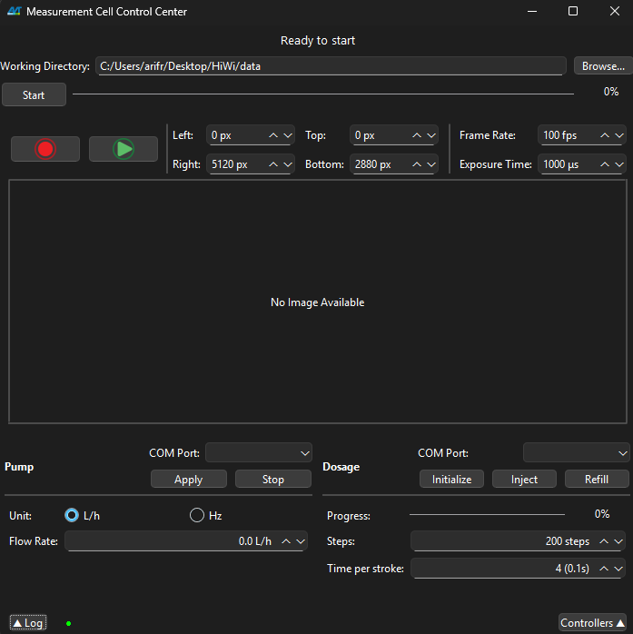
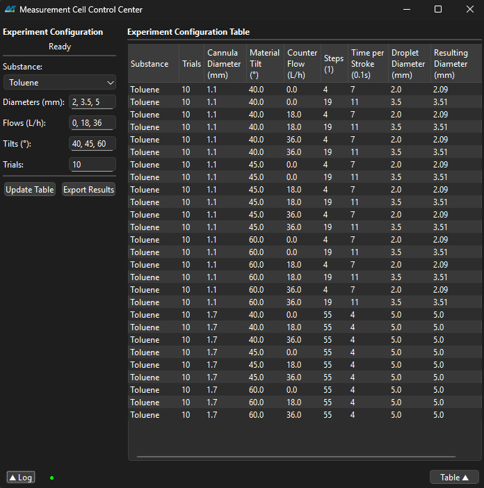
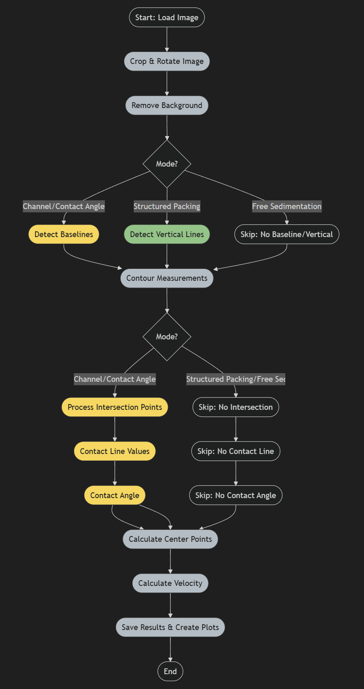

# MesszelleApp

<!-- Badges: Replace URLs with actual badge links as appropriate -->


> MesszelleApp is a research-oriented platform for automated droplet experimentation, quantitative image analysis, and experiment planning. Designed for academic and scientific workflows, it provides a reproducible, extensible, and user-friendly environment for laboratory automation and data analysis.

---


## 📑 Table of Contents

- [✨ Features](#-features)
- [🗂️ Project Structure](#-project-structure)
- [🖼️ Screenshots](#-screenshots)
- [🚀 Quick Start](#-quick-start)
- [💡 Usage Examples](#-usage-examples)
- [⚙️ Configuration](#-configuration)
- [🛠️ Troubleshooting](#-troubleshooting)
- [🤝 Contributing](#-contributing)
- [📝 License](#-license)
- [💬 Contact](#-contact)

---


## ✨ Features

- 🎛️ **Controller Tab:** Integrates camera, pump, and dosage automation for streamlined experimental control.
- 📊 **Analysis Tab:** Enables batch image processing, contact angle measurement, and droplet quantification.
- 📋 **Table Tab:** Facilitates experiment planning, calculation, and export of experiment matrices.
- 🖼️ **Visual ROI & Baseline:** Provides both graphical and numeric interfaces for region selection and baseline adjustment.
- 🗂️ **Batch Processing:** Supports analysis of multiple datasets with progress visualization.
- 📈 **Wobble & Velocity Analysis:** Advanced tools for droplet dynamics and time-series analysis.
- 📝 **Log Overlay:** Real-time logging of errors, warnings, and informational messages with status indicators.
- 🧪 **Manual Testing:** Includes curated test images for rapid validation and reproducibility.
- ⚡ **Modern UI:** Built with PySide6 (Qt for Python) for cross-platform compatibility and performance.

---


## 🗂️ Project Structure

| Directory         | Purpose                                              |
|-------------------|------------------------------------------------------|
| `src/core/`       | Core business logic (cell, camera, analysis, etc.)   |
| `src/widgets/`    | Main UI components (cell, camera, analysis, etc.)    |
| `src/helpers/`    | Image processing, analysis, and data saving helpers  |
| `src/threads/`    | Background processing for UI responsiveness          |
| `src/utilities/`  | Utilities for port, ROI, and camera management       |
| `config/`         | Conversion tables and requirements                   |
| `test_data/`      | Test images organized by experiment type             |

---


## 🖼️ Screenshots

<p align="center">
  
  <br><em>Controller Tab: Unified control for hardware automation.</em>
</p>

<p align="center">
  
  <br><em>Table Tab: Experiment planning and matrix export.</em>
</p>

<p align="center">
  
  <br><em>Analysis Tab: Batch image analysis and visualization.</em>
</p>

---


## 🚀 Quick Start

To install and launch MesszelleApp:

```sh
python -m venv venv
venv\Scripts\activate  # On Windows
# or
source venv/bin/activate  # On macOS/Linux
pip install -r config/requirements.txt
python app.py
```

Alternatively, double-click `MesszelleApp.exe` (Windows, prebuilt) or run `app.py` from your IDE with the correct Python environment.

---


## 💡 Usage Examples

### Batch Analysis (UI-driven)

1. Organize experiment images in a folder (see `test_data/` for examples).
2. Launch MesszelleApp and navigate to the **Analysis** tab.
3. Add or remove folders for batch processing as needed.
4. Adjust ROI, threshold, and baseline parameters.
5. Use **Preview** for a preliminary check, or **Full Analysis** for comprehensive processing.
6. Results (plots, tables) are saved in structured subfolders according to analysis mode.

### Logging & Troubleshooting

- All logs, warnings, and errors are displayed in the log overlay (bottom left).
- The log status indicator reflects error (red), warning (orange), or normal (green) states.
- Click the indicator to access the full log overlay and review details.

---

## ⚙️ Configuration

| Setting                | How to Change                | Default/Example                |
|------------------------|------------------------------|-------------------------------|
| Working Directory      | Set via UI in Controller Tab | (User-selected)                |
| ROI, Baseline, Params  | Set via UI in Analysis Tab   | (User-selected)                |
| Experiment Table       | Configure in Table Tab       | (User input, CSV export)       |
| Dependencies           | `config/requirements.txt`    | See file                       |
| Linting/Formatting     | `pyproject.toml`             | Ruff, Black-style, isort rules |

No environment variables or CLI flags are required.

---


## 🛠️ Troubleshooting

**App will not start / missing DLL:**
- Ensure all dependencies are installed: `pip install -r config/requirements.txt`
- On Windows, use the provided `.exe` or activate your virtual environment.

**No images found / cannot select folder:**
- Remove default folders and add your own via the UI.
- Verify folder structure and permissions.

**Analysis results appear incorrect:**
- Use preview mode before full analysis.
- Confirm ROI, threshold, and baseline settings.
- Increase ROI if images are cropped too small.
- Lower threshold for dark images.
- Rotate images if detection fails.

**Log overlay shows errors:**
- Click the log indicator for details.
- Most issues are resolved by restarting the application or adjusting parameters.

**Output folder did not update:**
- Set the working directory in the Controller tab before starting analysis.

---


## 🔬 Detailed Image Analysis Pipeline

<p align="center">
  
  <br><em>Figure: Overview of the image analysis pipeline implemented in MesszelleApp.</em>
</p>

---


## 🤝 Contributing

We welcome academic and research contributions. To contribute:

1. Fork this repository or create a branch (GitLab).
2. Branch off `development` for your feature or fix.
3. Follow the style in `pyproject.toml` and use Ruff for linting and formatting:
   ```sh
   pip install ruff
   ruff check .
   ruff format .
   ```
4. Test manually with the application and `test_data/` images.
5. Submit a pull/merge request with a clear description of your changes.

**Development notes:**
- UI: `src/widgets/` | Core: `src/core/` | Helpers: `src/helpers/`
- Use absolute imports (e.g., `from src.core.cell_core import ...`)
- Update documentation if you add features.

---


## 📝 License

This project is licensed under the MIT License. See [LICENSE](LICENSE) for details.

---


## 💬 Contact

- **GitLab:** [arraca22](https://git.rwth-aachen.de/arraca22)
- **GitHub:** [arraca22](https://github.com/arraca22)
- For questions, open an issue or reach out via GitLab.

---